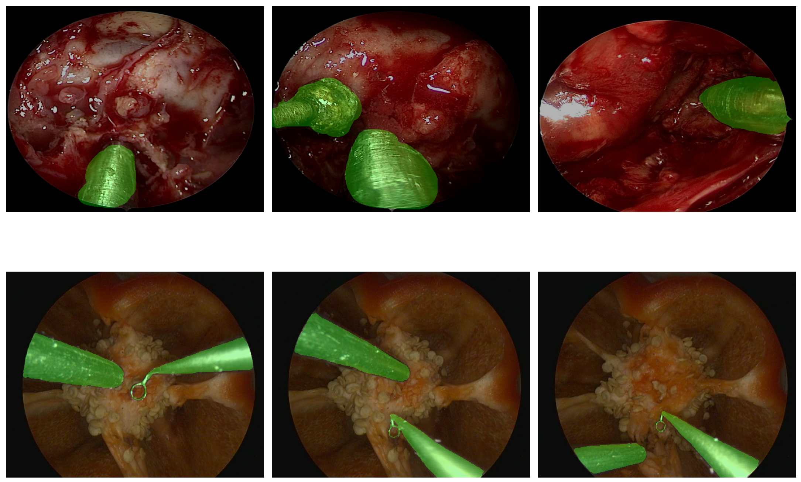

# cleverscope-project

This repository accompanies our research work on autonomous endoscope navigation in robot-assisted minimally invasive surgery.  

Robotic systems offer significant advantages in minimally invasive procedures. However, surgeons are still required to frequently switch control between surgical instruments and the endoscope, which can interrupt workflow and increase cognitive load.  

To address this limitation, we propose a system in which a robotic arm autonomously controls the endoscope during the procedure, allowing the surgeon to remain fully focused on the surgical task.

At this stage, we are releasing the dataset used in our study. The full source code is currently a work in progress and will be published here once it has been finalized and documented.

---

## Background

In robot-assisted minimally invasive surgery, proper visualization of the surgical field is critical. Traditionally, surgeons must manually adjust the endoscope view or rely on an assistant. This study introduces an autonomous endoscope navigation framework designed to:

- Reduce the need for manual camera control  
- Minimize workflow interruptions  
- Improve surgical focus and efficiency  

Our approach leverages a deep learning–based vision pipeline that:

1. **Segments surgical instruments** from the scene  
2. **Localizes instrument tips** with high precision  
3. Computes optimal **camera direction, speed, and zoom level**  

The vision pipeline was validated through a user study. The results demonstrate promising performance and suggest the potential for broader adoption of robotic endoscope holders in clinical practice.

---

## Dataset

The dataset used to train and validate the segmentation and tool-tip localization models is publicly available.

**Dataset Link:**  
https://drive.google.com/drive/folders/1rEn-xTIVC5EdAB_dkzeK7pBPva5ACMsj?usp=sharing

The dataset includes annotated frames for:
- Surgical instrument segmentation  
- Tool-tip localization

The dataset file structure is organized as follows;
```bash
├── Hacettepe Surgical Dataset
│   ├── imgs
│   │   ├── *.png
│   ├── masks
│   │   ├── *.png
│   ├── point_coordinates.json
├── Handcrafted Endoscope Dataset
│   ├── bell_pepper_imgs
│   │   ├── *.png
│   ├── bell_pepper_masks
│   │   ├── *.png
│   ├── point_coordinates.json
```



**Hacettepe University Surgery Dataset**: With the help of surgeons from Hacettepe University (Ankara, Turkey), our team collected approximately 1005 images from real surgical procedures. Because the dataset was initially unlabeled, binary masks were manually created for each image. Each frame contains one or two instruments at a resolution of 640x512 pixels. Due to the real surgical environment, these images exhibit variations in lighting, obstructions, and visual noise reflecting realistic operating conditions. Sample images can be seen in the top row of the image above.

**Handcrafted Endoscope Dataset**: To simulate surgical scenes in a controlled environment, our team collected a total of 464 images using an endoscope on a red bell pepper, along with surgical instruments. These images were segmented and labeled with instrument tip tags. The inside of the pepper was dyed red to mimic human tissue, and the images were acquired at a resolution of 640x512 pixels. Sample images can be seen in the top row of the image above.

If you use this dataset in your research, please cite the associated paper. Citation details will be added upon publication.

---

## Code Availability

The full implementation of:

- The deep learning segmentation model  
- The tool-tip localization module  
- The endoscope positioning algorithm  

is currently being prepared for public release.

The cleaned and documented codebase will be added to this repository soon.

---

## Contact

For questions, collaborations, or feedback, please open an issue in this repository.
